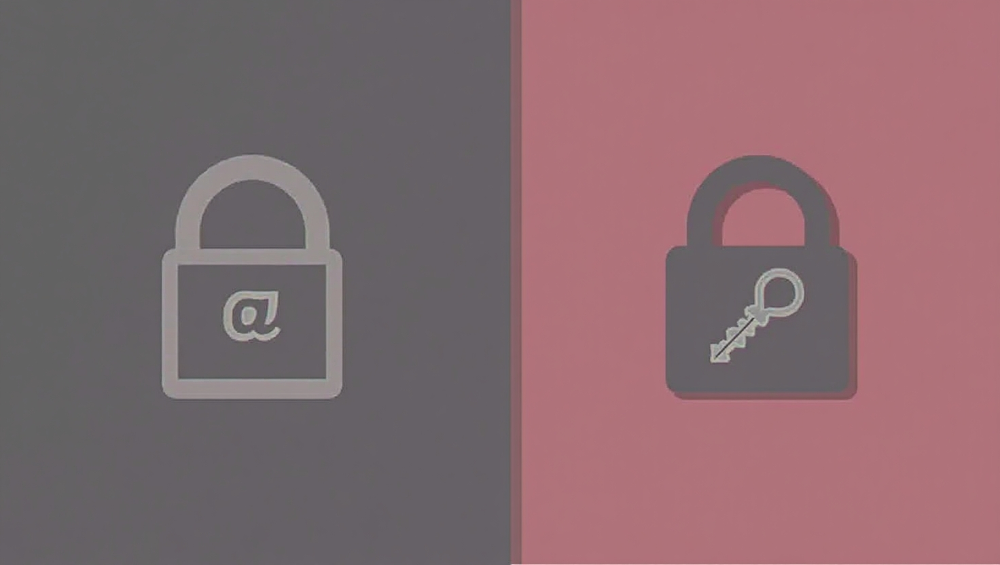

# EasyAuth-withEmail 📧🔐

A simple and secure **two-factor authentication** system using email. Users will receive a one-time code to verify their identity, adding an extra layer of protection to their accounts. Built using **HTML, CSS, and JavaScript** for a smooth and responsive user experience.

## 🚀 Live Demo

[View Project](https://arshiya-mh.github.io/EasyAuth-withEmail-/)

## 📌 Features

- ✅ Simple and secure email-based two-factor authentication  
- ✅ Smooth and responsive design  
- ✅ Built with **HTML**, **CSS**, and **JavaScript**  
- ✅ Easy-to-use interface for better user experience  

## 🛠️ Technologies Used

- **HTML**
- **CSS**
- **JavaScript**

## 📥 Installation & Usage

No installation required. Simply open the `index.html` file in your browser or visit the [Live Demo](https://your-live-demo-link.com).

## 📌 Screenshot

## 📜 License

This project is open-source and free to use.

---

🚀 Developed by [Arshiya MH](https://github.com/arshiya-mh)
